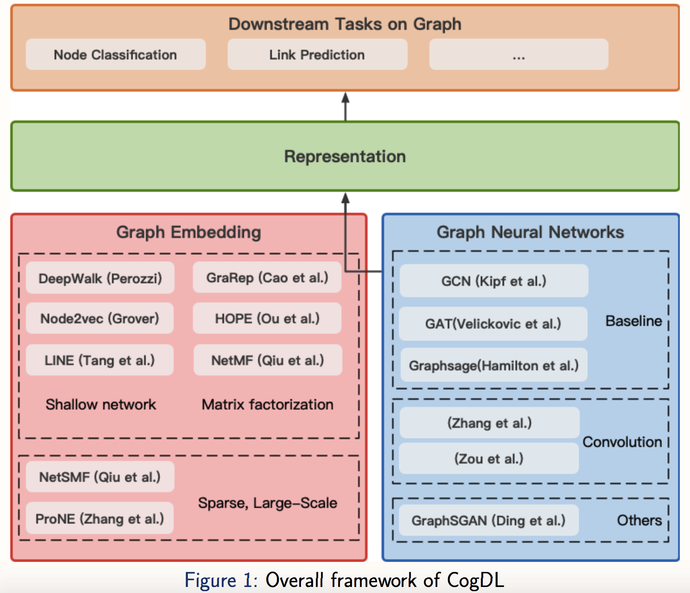

# CogDL-TensorFlow
```CogDL-TensorFlow```: The TensorFlow Implementation of [CogDL](http://keg.cs.tsinghua.edu.cn/cogdl/). With Support from Professor [Jie Tang](https://weibo.com/jietangthu).

# CogDL


```CogDL``` is a graph representation learning toolkit that allows researchers and developers to easily train and compare baseline or custom models for node classification, link prediction and other tasks on graphs. It provides implementations of many popular models, including: 
 * non-GNN Baselines like Deepwalk, LINE, NetMF;
 * GNN Baselines like GCN, GAT, GraphSAGE.

 

# Discussion Group

```CogDL-TensorFlow``` is still under planning. Guys who are interesting in working on this project, welcome to add my wechat below and join our discussion group.
<div align=left>

</div>
